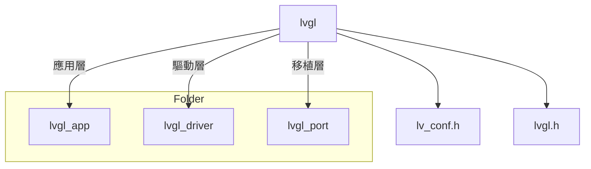

# nrf52_lvgl_porting

- SDK : nRF5_SDK_15.2.0_9412b96
- IDE : Keil
- LVGL : v8.2
- project : nRF5_SDK_15.2.0_9412b96\examples\peripheral\ili9341_lvgl_test
- monitor : 2.4 吋 TFT+觸控螢幕 ILI9341 SPI液晶屏模塊 240*320 (ili9341.c ili9341.h為驅動，參考 nRF5_SDK_15.2.0_9412b96\components\drivers_ext\ili9341 )

- (P.S.) 此Project 有用到nrf_lcd.h，路徑在(nRF5_SDK_15.2.0_9412b96\components\libraries\gfx)

### Project Folder diagram

## LVGL 移植

https://hackmd.io/kboEbfFgSI29kvuhmhYtrQ

## 成果

