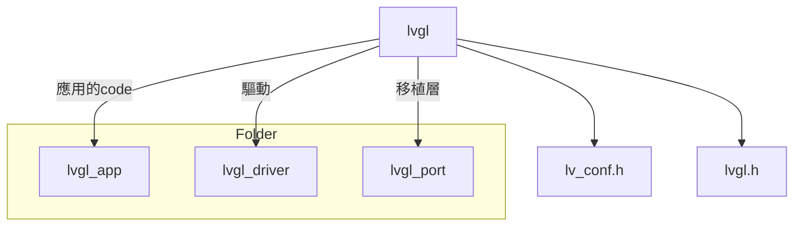

# nrf52_lvgl_porting

- SDK : nRF5_SDK_15.2.0_9412b96
- IDE : Keil
- LVGL : v8.2
- project : nRF5_SDK_15.2.0_9412b96\examples\peripheral\ili9341_lvgl_test
- monitor: 2.4 吋 TFT+觸控螢幕 ILI9341 SPI液晶屏模塊 240*320 (ili9341.c
ili9341.h為驅動)

https://www.google.com/search?q=ili9341+%E8%A7%B8%E6%8E%A7&rlz=1C1CHBF_zh-TWTW908TW908&sxsrf=APq-WBvOZfmDRnyIQBr6SeDtoTK_TYy3qQ:1649431273137&source=lnms&tbm=isch&sa=X&ved=2ahUKEwj6ofeo4oT3AhXoyIsBHYAWCr8Q_AUoAXoECAEQAw&biw=958&bih=927&dpr=1#imgrc=GUj5JM35cgxemM

### Project Folder diagram

## LVGL 移植

https://hackmd.io/kboEbfFgSI29kvuhmhYtrQ
